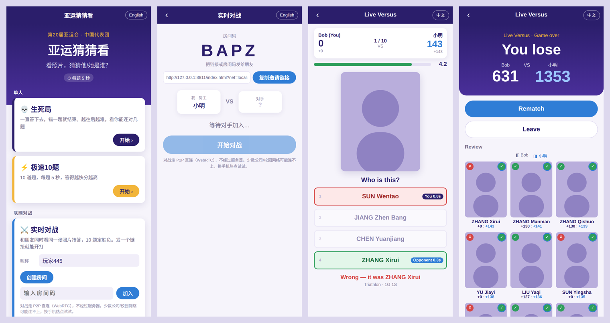
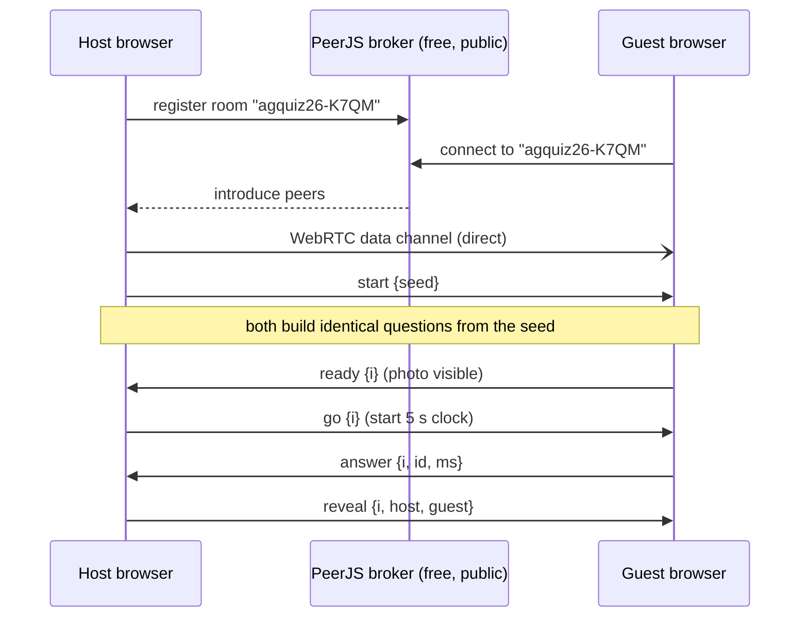

# Sportify

**亚运猜猜看 · Guess the Athlete** — ▶️ **Play: https://bigjackcn.github.io/sportify/**

**Who's in the photo?** A fast quiz game built on Team China's 800 athletes at the 20th Asian Games (Aichi–Nagoya 2026). Play solo, or challenge a friend to a **live head-to-head match over a direct peer-to-peer connection** — no game server, no database, no build step.

看照片猜运动员。第 20 届亚运会中国代表团 800 名运动员，单人闯关或者发个链接和朋友**实时对战**。纯静态网页，不需要服务器。



<sub>Screenshots use placeholder silhouettes; the live game shows the official athlete photos.</sub>

## Features

| | |
|---|---|
| 💀 **Death Match** | Keep answering until you miss one. The first 10 are medallists; after that, anyone on the team, with same-sport decoys. |
| ⚡ **Speed 10** | 10 medallists, 5 seconds each. 50 points for a correct answer plus up to 100 for speed. |
| ⚔️ **Live Versus** | Create a room, share the link, and both players see the same photo at the same moment. 10 rounds, speed-based scoring, rematch button. |
| ⏱ **5-second clock** | The clock starts only once the photo is actually on screen, so slow networks aren't penalised. |
| 🌏 **中文 / English** | Follows the browser language and can be switched any time. In a match, each player can use their own language. |
| 📊 **Recognition board** | A global leaderboard of *athletes*: who players worldwide recognise most, who gets missed most, who is spotted fastest. After each answer you also see “recognised by 87% of players”. Optional — needs a free Supabase project. |
| ⌨️ **Keyboard** | Press `1`–`4` to answer and `Enter` for the next question. |

## How the live versus works

There's no game server. The free public [PeerJS](https://peerjs.com) broker only introduces the two browsers to each other. After that, all game traffic goes over a direct WebRTC data channel.



- **The host decides.** The host picks a random seed, waits until both players have the photo loaded, starts each round, collects both answers and broadcasts the result.
- **Only small messages cross the network.** Both sides generate the same questions from the shared seed (a seeded PRNG), so the questions themselves are never sent.
- **Dropped connections are detected.** A heartbeat notices a player who disappears, even if the browser never sends a proper disconnect.
- **A few networks will block it.** WebRTC can fail behind very strict corporate firewalls. Try a phone hotspot.

## Run locally

ES modules need to be served over HTTP. Opening the file directly won't work.

```bash
npx serve .            # or: python3 -m http.server 5173
```

Then open `http://localhost:5173`.

**To test versus on one machine**, add `?net=local`. Two tabs then talk over `BroadcastChannel` instead of WebRTC.

```
http://localhost:5173/?net=local
```

## Tests

```bash
npm test
```

- `test/game.test.mjs` covers question generation, scoring and data sanity, including 3,000 randomised runs.
- `test/versus.test.mjs` simulates two players over a laggy link (0, 40 and 400 ms) with a fake clock. It covers score agreement on both sides, rematch, a photo that never loads, a clean leave, and a silent disconnect.

## Deploy to GitHub Pages (free)

1. Push this repo to GitHub.
2. In the repo, go to **Settings → Pages**. Set **Source** to *Deploy from a branch*, then pick branch `main` and folder `/ (root)`. Save.
3. After a minute the game is live at `https://<your-username>.github.io/<repo-name>/`.

You can share that link directly; invite links work the same way.

## Global recognition board (optional, free)

The board stores one row per athlete (`seen`, `correct`, `total_ms`) in a free [Supabase](https://supabase.com) Postgres database. The browser talks to Supabase's REST API directly — no server code.

1. Sign up at supabase.com → **New project** (free plan, any region; pick one close to your players).
2. In the project, open **SQL Editor → New query**, paste the contents of [`supabase/setup.sql`](supabase/setup.sql) and click **Run**.
3. Open **Project Settings → API Keys** (or **Connect**) and copy the **Project URL** and the **publishable** key (`sb_publishable_…`; older projects call it the `anon` key).
4. Put both into [`js/config.js`](js/config.js), commit and push. The 📊 card appears on the home page.

Security model: the key in `config.js` is meant to be public. Row-level security lets anyone **read** the table but nobody can write to it directly; the only write path is the `record_answers()` function, which accepts at most 30 answers per call, validates ids and clamps times. It's a fan game, so there's no anti-cheat beyond that.

Notes: free Supabase projects are paused after about a week without any traffic — if the board stops loading, open the Supabase dashboard and click **Restore**. Leave `config.js` empty and the game simply runs without the board.

To test locally without Supabase, `npm test` includes `test/stats.test.mjs` (ranking maths, batching, clamping).

## Project structure

```
index.html          single page
css/style.css
js/
  main.js           UI (plain DOM, no framework)
  game.js           modes, question & decoy generation, scoring — pure logic
  versus.js         live match protocol — transport/UI independent
  net.js            PeerJS (WebRTC) + BroadcastChannel transports
  stats.js          global recognition board (Supabase REST)
  config.js         Supabase URL + publishable key (optional)
  athletes.js       generated data: 800 athletes
  messages.js       zh / en strings
  sports.js         sport names zh / en
supabase/setup.sql  one-time database setup for the board
tools/              data pipeline (Node)
test/               Node tests
```

## Data

The roster, birth dates, events and medal counts come from the official results system ([results.asiangames2026.org](https://results.asiangames2026.org)). Chinese names come from the delegation list published by the Chinese Olympic Committee. They were matched automatically by pinyin plus sport, and 13 tricky ones were fixed by hand (`tools/zh_overrides.json`).

To refresh the data (Node 18+):

```bash
cd tools && npm install
node fetch-data.mjs             # rebuilds js/athletes.js
node fetch-data.mjs --photos    # also downloads and compresses photos into photos/
```

Photos are **not** stored in this repo. The game loads them from the official site at runtime.

## Disclaimer

This is a non-commercial fan project for learning purposes. It isn't affiliated with the Olympic Council of Asia, the Aichi–Nagoya organising committee or the Chinese Olympic Committee. Athlete photos and results belong to their respective owners. The code is MIT-licensed; the licence doesn't cover the data or the photos.
